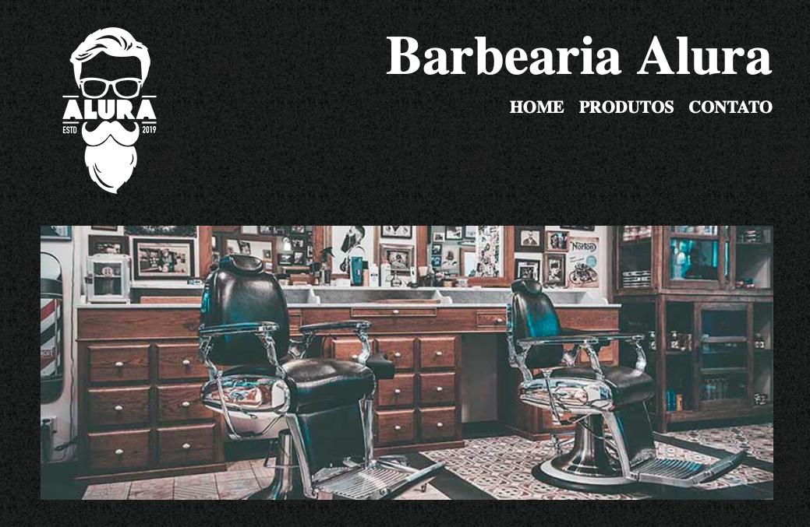
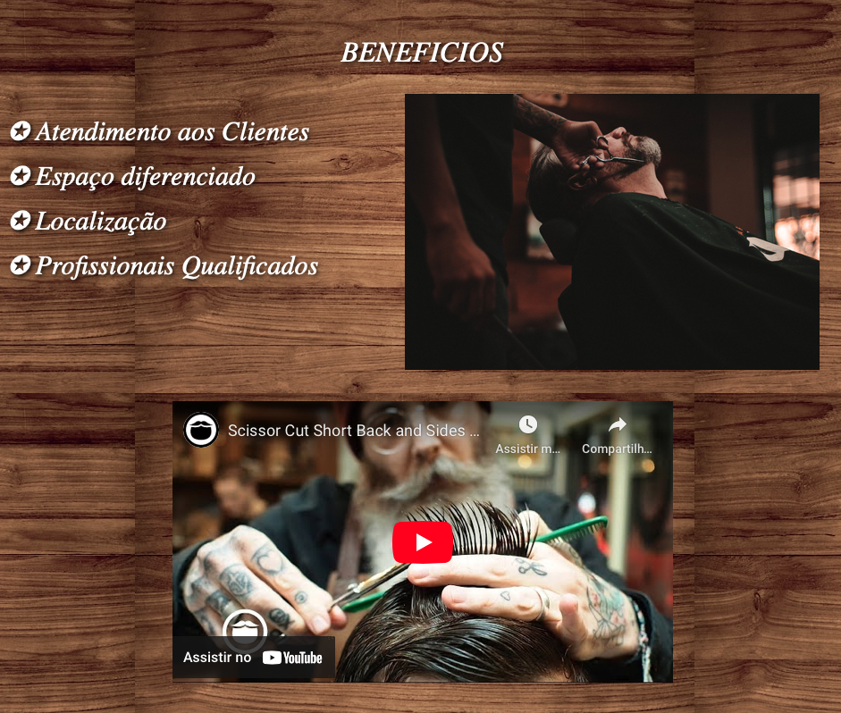

# Barbearia Alura

Este projeto foi proposto pela plataforma de ensino Alura com o intuito de validar os conhecimentos adquiridos no curso de Introdução ao Desenvolvimento Web. O projeto consiste em uma página da barbearia com informações fornecidas pela Alura.






## 🚀 Começando

Essas instruções permitirão que você obtenha uma cópia do projeto em execução na sua máquina local para fins de desenvolvimento e teste. Consulte **[Matheus De La Barra](https://www.linkedin.com/in/matheus-de-la-barra-82345aa5/)** para saber como implantar o projeto.

### 📋 Pré-requisitos

Você precisará instalar um navegador web para executar os arquivos .html e plataformas ou aplicações IDE para editar ou modificar este repositório.

```
Exemplo de navegadores:

Google Chrome, Microsoft Edge, Firefox, Opera, Safari.

Exemplo de IDE: 

Vscode, Sublime Text, Atom, Notepad++.
```

### 🔧 Instalação

```
Primeiro, copie ou baixe este repositório para sua máquina local.

Em seguida, execute o arquivo index.html com seu navegador padrão:

Navegue entre as abas do cabeçalho.

Até finalizar.
```

## 📦 Implantação

Para uso em Barbearias, recomenda-se o uso de outras tecnologias para melhorar este repositório, já que este trata-se de um repositório com fins acadêmicos.

## 🛠️ Construído com

* [CSS](https://www.alura.com.br/formacao-html-e-css) - Utilizado para estilização.
* [HTML](https://www.alura.com.br/formacao-html-e-css) - Usado para marcação de texto web.
* [VSCODE](https://vscode.dev) - Usado para o ambiente de desenvolvimento.

## 📌 Versão

Usamos [Git](https://git-scm.com) para controle de versão. Para as versões disponíveis, confira as [tags neste repositório](https://github.com/MatheusDeLaBarra/primeira-pagina-web/tags). 

## ✒️ Autores

* **Matheus De La Barra** - *Trabalho Inicial* - [Matheus De La Barra](https://github.com/MatheusDeLaBarra)
* **Matheus De La Barra** - *Documentação* - [Matheus De La Barra](https://github.com/MatheusDeLaBarra)

## 📄 Licença

Este projeto está sob a licença (sua licença) - veja o arquivo [LICENSE.md](https://github.com/MatheusDeLaBarra/primeira-pagina-web/blob/main/licenca.md) para obter detalhes.

## 🎁 Expressões de gratidão

* Conte a outras pessoas sobre este projeto 📢;
* Convide alguém da equipe para uma cerveja 🍺;
* Agradeça publicamente 🫂;
* etc.


---
⌨️ com ❤️ por [Matheus De La Barra](https://github.com/MatheusDeLaBarra) 😊